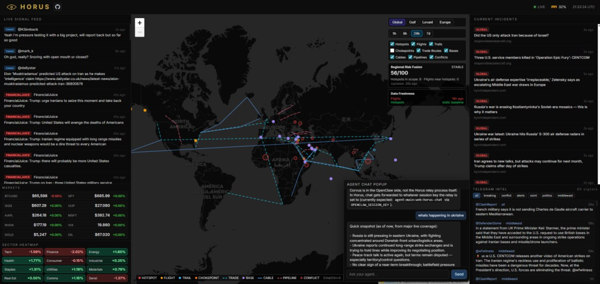

# Horus

Horus is a **open-source fully standalone OSINT terminal** built for fast situational awareness.

It combines live signals, incident aggregation, military flight context, market overlays, and an integrated agent chat into one operator-style interface.

It is designed to integrate directly with your OpenClaw agent, so you can text it from anywhere on the go with prompts like: "how are things in iran" or "what's the markets looking like".

Horus is opensource to empower the people. All donations should be sent to my Solana wallet `hgof84NNrXzQzxPTKhixokrkPtreMFs4gXzXeFgUK5j`. Fully optional.



---

## Why Horus

- **Local-first runtime** (you control the stack)
- **Relay-backed architecture** (frontend reads normalized `/api/*` only)
- **Cross-channel agent workflows** (OpenClaw + in-dashboard chat)
- **Modular map layers** (hotspots, routes, chokepoints, bases, cables, pipelines, conflicts)

---

## Repository layout

- `horus-ui-react/` — React + Vite frontend
- `horus-relay/` — data relay + pollers + bridge endpoints
- `horus-skill/` — operator/agent behavior docs
- `docs/` — assets and documentation

---

## Quickstart

### Recommended install flow (OpenClaw)

Horus is designed to run locally with an OpenClaw agent.

> Text your agent: `install & clone https://github.com/corvuslatimer/horus.git`

### Manual local run

```bash
# terminal 1
cd horus-relay
npm install
npm run dev

# terminal 2
cd horus-ui-react
npm install
npm run dev -- --host 127.0.0.1 --port 8080
```

---

## Runtime model

- Frontend calls relay endpoints only (`/api/*`)
- Relay polls upstream sources and persists local state in `horus-relay/data/`
- Live signal stream is stored in `signals.ndjson` (rolling cap)
- Secrets stay in relay runtime configuration

---

## Security baseline

- Never commit credentials
- Never commit runtime `horus-relay/data/*`
- Prefer private networking for operator deployments

---

## Status

Horus is under active development and evolving quickly.
